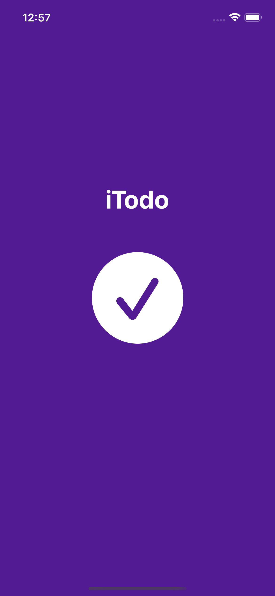
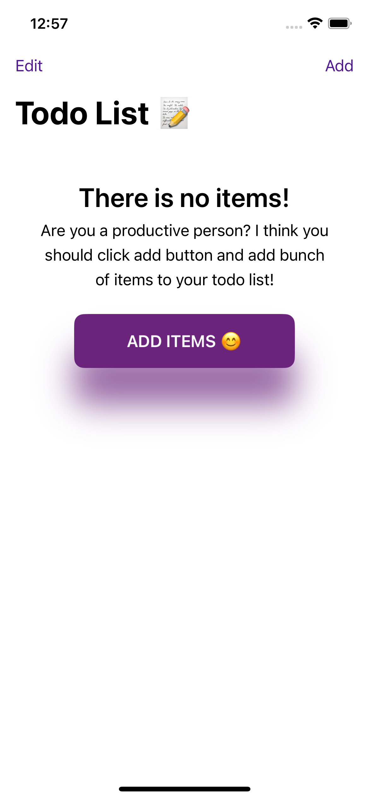
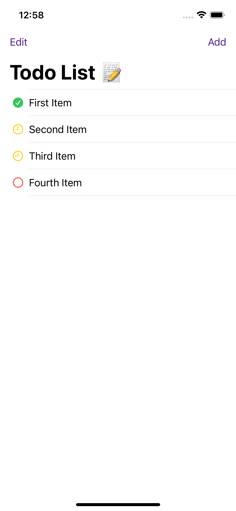

# 📱 iTodo - SwiftUI ToDo App

iTodo is a minimalist and elegant ToDo app built using **SwiftUI**. It helps users manage tasks with a simple and intuitive interface, smooth animations, and persistent local storage.

---

## 🚀 Features

- 📝 Create, update, and delete tasks
- ✅ Mark tasks as pending, in-progress, or completed
- 💾 Lightweight data persistence using `UserDefaults`
- 🔁 Smooth task status transitions with animations
- 🌓 Auto-adapts to light & dark mode

---

## 💾 Data Persistence

iTodo uses **UserDefaults** to persist your to-do list locally.

- All tasks are encoded with `Codable` and stored using `UserDefaults.standard`.
- Fully offline — no sign-in or internet required.
- Tasks remain saved across app launches.

---

## 📷 Preview

<table>
  <tr>
    <td></td>
    <td></td>
  </tr>
  <tr>
    <td></td>
    <td></td>
  </tr>
</table>

## 📂 Project Structure

```

iTodo/
├── Models/
│ └── ItemModel.swift
├── Views/
│ ├── ListView\.swift
│ ├── ListRowView\.swift
│ ├── EmptyItemsView\.swift
│ └── AddView\.swift
│ └── LaunchScreen\.storyboard
├── ViewModels/
│ └── ListViewModel.swift
├── preview/
│ ├── screen1.png
│ ├── screen2.png
│ ├── screen3.png
│ └── screen4.png
├── TodoApp.swift
└── README.md

```

---

## 🛠️ Tech Stack

- **Language**: Swift
- **Framework**: SwiftUI
- **Architecture**: MVVM

---

## 💡 Getting Started

1. Clone the repository:

   ```bash
   git clone https://github.com/yourusername/iTodo.git

   ```

2. Open the project in Xcode:

   ```bash
   open iTodo.xcodeproj
   ```

3. Run the app in an iOS Simulator or on a physical device.

---

## 🧪 Requirements

- macOS Monterey or later
- Xcode 14+
- iOS 15+

---

## 📄 License

This project is open-source and available under the [MIT License](LICENSE).
